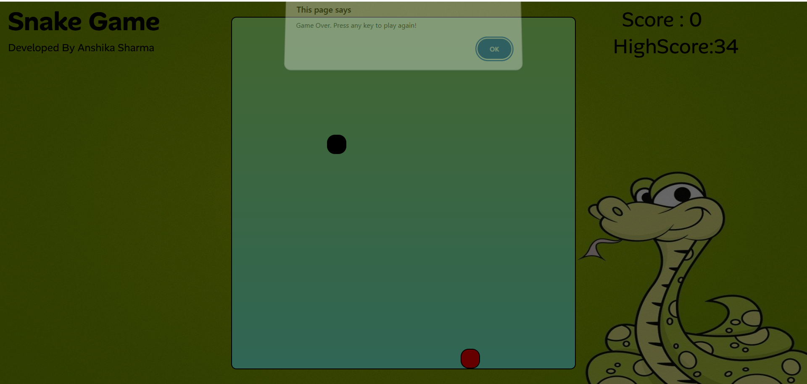

# 🐍 Snake Game

A classic **Snake Game** built using **HTML, CSS, and JavaScript**, featuring **sound effects** for food collection and game over events to enhance the user experience.

---

## 🎮 Features

- 🐍 Classic snake movement
- 🍎 Random food generation
- 🔊 Sound effect when snake eats food
- 🔔 Sound effect on game over
- 📈 Score tracking
- 🎯 Game over detection
- ⌨️ Keyboard controls

---

## 🛠️ Technologies Used

- **HTML5** – Game structure  
- **CSS3** – Styling and layout  
- **JavaScript** – Game logic, events & audio handling  

---

## 📸 Game Preview

---

## 📂 Project Structure

